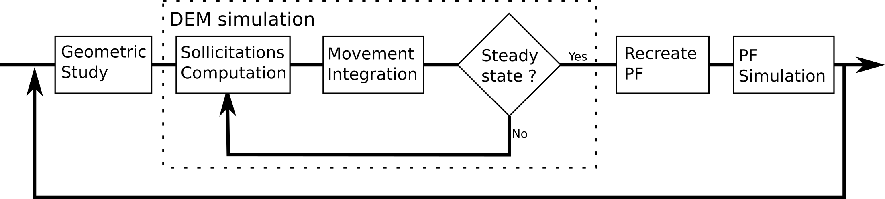

# PFDEM_CHAC
Phase-Field Discrete Element Modelisation applied to granular material.

## Simulation presentation

## Technical description
A back and forth is done between phase-field (PF) simulation and discrete element model (DEM). The following scheme illustrated the algorithm.

 PF approach is computed with [MOOSE](https://github.com/idaholab/moose) and DEM is computed with an own script based on python 3.9.6. The launch of this project is done by executing the python script <i>main.py</i>. The user can change variables inside the python script <i>User.py</i>. A documentation explains what is the role of the different variable.

### PF
The goal of the PF step is to compute the shape of the grains as it evolves with the dissolution.
A Cahn-Hillard Allen-Cahn formulation is used.

### DEM
The goal of the DEM step is to compute a steady-state configuration. Grains are assumed as polygonal. The shape is computed from an interpolation of the PF variable.

## What is next ?
Some next releases are presented here.

- increase the user experience (homogenize names, correct english)
- correct the functions P_is_inside() because if the coordinate y = the coordinate of the vertex, the point is considered outside (even  if it is not the case)
