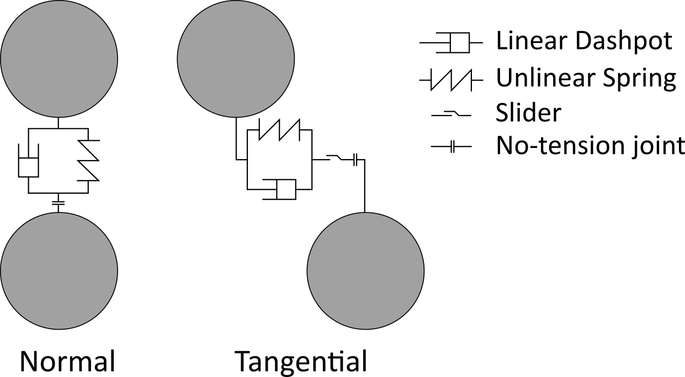

# DEM documentation

## What is a grain ?

A grain is a polygonal particle defined initially by the coordinates of the vertices and some material proprieties (Young modulus, Poisson's ratio, surface mass). By applying a [Monte Carlo method](https://en.wikipedia.org/wiki/Monte_Carlo_method), the surface and the center of the mass of the grain are determined.

A grain can interact with another grain.

## Grain - grain interaction

The contact between two particles is determined by applying the method developped by <i>Nezami et al.</i>.

Once the contact is determined, Hertz laws illustrated by the following scheme are applied to the contact.

## References

E. Nezami, Y. Hashash, Zhao D., Ghaboussi J., A fast contact detection algorithm for 3-D discrete element method (2004) Computers and Geotechnics, Vol. 31, Pages 575-587, DOI : 10.1016/j.compgeo.2004.08.002
